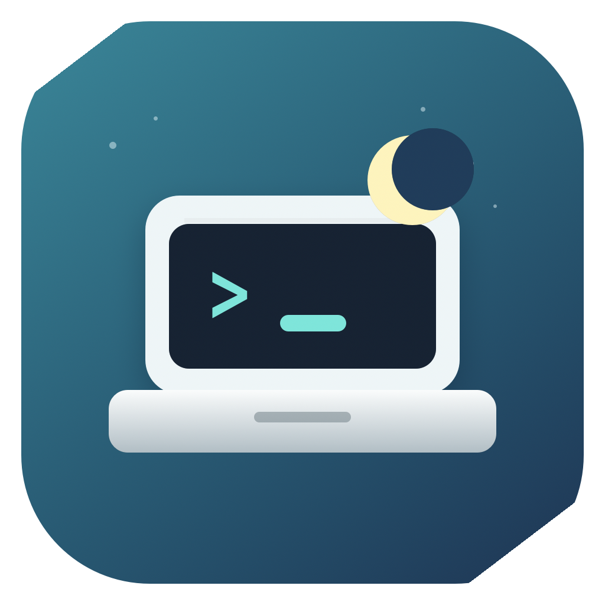

# Close Your Laptop

<p align="center">
  
</p>

**Close Your Laptop** is a tiny macOS menu bar app that keeps a MacBook awake with the lid closed while Claude Code or OpenAI Codex is actively working, then lets the laptop sleep as soon as the work is done.

It is built for the very specific battery-first workflow of starting an AI coding agent, closing the laptop, and letting the machine finish the job without turning into an all-night battery drain.

## Why This Exists

Most keep-awake utilities are broad caffeine switches: they keep the Mac awake because you told them to, and they keep doing it until you remember to turn them off.

Close Your Laptop is narrower:

- Keep macOS awake only while Claude or Codex is doing active project work.
- Support closed-lid work on battery, where normal IOKit sleep assertions are often not enough.
- Release sleep holds quickly after the agent finishes.
- Avoid treating idle Electron apps, renderers, MCP servers, or helper processes as real work.
- Stay small: native process scanning, sparse polling, no Accessibility permission, no heavyweight background service.

## What It Watches

The app looks for active Claude and Codex work from both terminal and desktop workflows:

- Claude Code CLI processes such as `claude`, `claude-code`, and `@anthropic-ai/claude-code`
- OpenAI Codex CLI processes such as `codex`, `codex-cli`, and common Codex package paths
- Claude Desktop and Codex Desktop GUI work when the app's process tree shows measurable non-infrastructure CPU activity

For GUI apps, Close Your Laptop intentionally ignores idle app furniture: Electron renderers, GPU helpers, utility helpers, crash reporters, `codex_chronicle`, parked app servers, idle REPLs, MCP tool servers, update helpers, and login shells.

## Sleep Behavior

When real agent work is active, the app creates native macOS power assertions:

- `PreventUserIdleSystemSleep`
- `PreventSystemSleep`

For battery-powered closed-lid work, macOS can still ignore ordinary app assertions. Close Your Laptop therefore uses a temporary `pmset disablesleep` override while work is active. macOS asks for administrator approval the first time this is needed during an app run; after that, a tiny privileged watchdog handles active/idle transitions without repeated password prompts.

When Claude or Codex stops working, the app disables the closed-lid override and releases its sleep assertions. If the app quits, crashes, or stops refreshing its watchdog heartbeat, the watchdog restores normal sleep behavior.

## Battery-First Design

This is not a clamshell-desk-mode app and it is not trying to keep your Mac awake forever.

The goal is:

1. Start Claude Code or Codex on a project.
2. Close the laptop.
3. Let the agent finish cleanly.
4. Let macOS sleep again to preserve battery.

That makes false positives costly, so the detector prefers to let an idle GUI app sleep rather than hold the Mac awake just because Claude or Codex is still open.

## Low-Overhead Launching

Close Your Laptop can run as an ephemeral helper instead of a permanent menu-bar resident.

- Terminal workflows can use lightweight `codex` and `claude` wrappers that mark a CLI session, start the app, and remove the session marker when the command exits.
- GUI workflows can use a tiny LaunchAgent watcher that listens for Claude Desktop and Codex Desktop launch events, then starts the main app.
- The watcher does not scan processes, hold power assertions, use Sparkle, or ask for administrator approval.
- The main app still owns all sleep decisions and quits itself after Claude/Codex apps, CLI sessions, active workers, and grace periods are gone.

Local setup helpers:

Use the menu bar item:

- `Tiny Persistent Watcher` > `Install` appears only when the watcher is missing.
- `Tiny Persistent Watcher` > `Update` appears only when the installed watcher or LaunchAgent does not match the current app bundle.
- `Tiny Persistent Watcher` > `Uninstall` appears only when the watcher is installed.

The CLI helpers remain available for development and terminal-wrapper setup:

```bash
./script/install_cli_wrappers.sh
```

## Menu Bar

The menu bar item shows:

- `Awake` when Close Your Laptop is holding sleep assertions
- `Sleep OK` when macOS is free to sleep

The menu includes the current assertion state, detected Claude/Codex sessions, a monitoring toggle, refresh, Sparkle update check, and quit.

## Automatic Updates

Close Your Laptop uses [Sparkle](https://sparkle-project.org/) for updates. The app checks a GitHub-hosted appcast in the background and shows Sparkle's standard update prompt when a newer signed release is available. The menu also includes `Check for Updates...` for a manual Sparkle check.

Updates are not silently installed. The user can install or skip an offered version; if a newer version is published later, Sparkle can prompt again. Release summaries come from the appcast item so the update prompt explains what changed.

Sparkle updates the main app bundle. If the tiny persistent watcher was installed separately, the app compares that helper and its LaunchAgent path against the current bundle and offers `Tiny Persistent Watcher` > `Update` when the watcher needs to be refreshed from the Sparkle-updated app.

## Build From Source

Requirements:

- macOS 13 or newer
- Xcode command line tools
- Swift Package Manager

Build and run:

```bash
swift test
./script/build_and_run.sh
```

The build script stages a local app bundle at:

```text
dist/Close Your Laptop.app
```

The app icon is generated from:

```bash
swift script/generate_app_icon.swift
```

## Project Status

Close Your Laptop is an early field-test macOS utility. The core behavior is intentionally small and auditable: process activity detection, power assertions, closed-lid battery handling, sparse logging, and Sparkle update plumbing.

Keywords for discoverability: macOS keep awake, MacBook closed lid, closed-lid sleep prevention, Claude Code, OpenAI Codex, Codex Desktop, Claude Desktop, AI coding agent, battery-first clamshell, menu bar utility.
